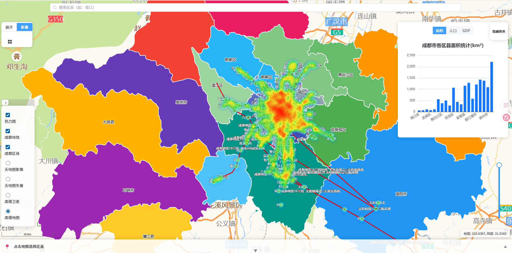

# 成都市智慧地图平台

基于 **Vue 3 + OpenLayers + ECharts** 的 GIS 数据可视化单页应用，聚焦成都市 23 个区县的面积、人口、GDP 等多维数据的交互式地图展示与分析。

## 技术栈

| 类别       | 技术                                 |
| ---------- | ------------------------------------ |
| 框架       | Vue 3 (Composition API) + TypeScript |
| 构建       | Vite 7                               |
| 地图引擎   | OpenLayers 10                        |
| 空间分析   | Turf.js 7                            |
| 图表可视化 | ECharts 6                            |
| 状态管理   | Pinia 3                              |
| UI 组件库  | Element Plus 2                       |
| 代码规范   | ESLint + Oxlint + Prettier           |

## 功能特性



### 地图与图层

- **多底图切换**：高德地图、高德卫星、天地图矢量、天地图影像，通过 LayerSwitcher 控件一键切换
- **成都市 23 个区县矢量边界**：从阿里云 DataV API 动态加载 GeoJSON，多色系渲染
- **成都地铁线路与站点**：本地 GeoJSON 数据叠加，区分站点（Point）与线路（LineString）样式渲染
- **地铁站点热力图**：基于站点分布自动生成热力图层，支持动态权重更新
- **图层透明度调节**：右侧滑块实时控制区县矢量图层透明度

### 数据统计与联动

- **多指标切换**：面积（km²）、常住人口（万人）、GDP（亿元）一键切换，ECharts 柱状图同步更新
- **地图-图表双向联动**：点击地图区县 → 图表聚焦该区县数据；点击图表 → 可扩展为地图高亮
- **底部信息面板**：选中区县后自动展开，展示面积/人口/GDP 详情，支持复制数据、导出 JSON

### 空间分析工具

- **绘制工具**：支持点、线、面的自由绘制
- **测量工具**：距离测量（自动换算 km/m）、面积测量（自动换算 km²/m²），实时跟随鼠标显示
- **缓冲区分析**：基于 Turf.js 对绘制的线或面生成指定半径的缓冲区

### 搜索与交互

- **区县搜索**：顶部搜索框，输入区县名称自动定位并高亮目标区域
- **坐标显示**：右下角实时显示鼠标位置经纬度
- **比例尺**：左下角公制比例尺

### 工程化

- **Hooks 模块化**：地图、图表、绘制、搜索、地铁、热力图、缓冲区各自独立封装，职责清晰
- **Pinia 状态管理**：地图实例和绘制工具实例全局共享
- **响应式布局**：适配桌面与移动端
- **Canvas 性能优化**：自动 patch `willReadFrequently` 避免 GPU 回读损耗
- **加载状态与错误处理**：地图加载遮罩、数据异常提示及重试机制

## 项目结构

```
vue-project/
├── public/
│   ├── data/
│   │   └── 成都地铁.geojson          # 地铁线路与站点数据
│   └── favicon.ico
├── src/
│   ├── components/Layout/
│   │   ├── leftTools.vue            # 左侧工具菜单（绘制/测量/分析）
│   │   ├── SearchBox.vue            # 顶部区县搜索框
│   │   ├── echartsChart.vue         # 右侧 ECharts 图表面板
│   │   └── BottomInfoPanel.vue      # 底部区县信息面板
│   ├── hooks/
│   │   ├── useMap.ts                # 地图初始化、底图配置、LayerSwitcher
│   │   ├── useData.ts               # 区县数据加载与指标切换
│   │   ├── useDrawTools.ts          # 绘制、测量、选择、缓冲区分析
│   │   ├── useSearchTools.ts        # 区县搜索与视图定位
│   │   ├── useMetro.ts              # 地铁图层加载与样式
│   │   ├── useHeatMap.ts            # 热力图生成与权重更新
│   │   ├── useBuffer.ts             # Turf.js 缓冲区计算
│   │   └── useECharts.ts            # ECharts 初始化与渲染
│   ├── stores/
│   │   └── map.ts                   # Pinia 全局地图 Store
│   ├── utils/
│   │   ├── styles.ts                # 区县/地铁/高亮样式定义
│   │   └── canvasOptimize.ts        # Canvas 性能补丁
│   ├── styles/
│   │   ├── map.css                  # 地图全局样式
│   │   └── layerswitcher.css        # 图层切换控件样式
│   ├── views/
│   │   └── MapView.vue              # 地图主视图容器
│   ├── App.vue                      # 根组件
│   ├── main.ts                      # 入口文件
│   └── env.d.ts                     # 类型声明
├── index.html
├── vite.config.ts                   # Vite 配置（含高德地铁代理）
├── tsconfig.json
├── eslint.config.ts
├── .oxlintrc.json
├── .prettierrc.json
├── .env.example                     # 环境变量示例
└── LICENSE
```

## 快速开始

**环境要求**：Node.js ^20.19.0 或 >=22.12.0

```bash
# 克隆项目
git clone <your-repo-url>
cd vue-project

# 安装依赖
npm install

# 启动开发服务器（默认 http://localhost:5173）
npm run dev

# 类型检查
npm run type-check

# 代码检查与格式化
npm run lint
npm run format

# 构建生产版本
npm run build

# 预览构建结果
npm run preview
```

## 架构设计

### 数据流

```
GeoJSON API / 静态数据
        │
        ▼
   useData / useMetro / useHeatMap (Hooks 层)
        │
        ▼
   Pinia Store (mapStore)  ←── 全局状态共享
        │
        ▼
   MapView.vue (视图容器)
        │
   ┌────┼────┬──────────┐
   ▼    ▼     ▼          ▼
 地图  图表  搜索框    信息面板
```

### 设计原则

- **关注点分离**：每个 Hook 负责一个独立功能域，组件只做组装和事件分发
- **全局状态最小化**：仅地图实例和绘制工具实例放入 Store，避免过度集中
- **容错设计**：区县数据加载失败不影响底图显示，地铁/热力图加载失败不影响核心功能
- **类型安全**：所有 Hook 返回值通过 `ReturnType<>` 推导类型，确保组件间调用类型一致

## 数据来源

| 数据              | 来源                                      |
| ----------------- | ----------------------------------------- |
| 成都区县 GeoJSON  | 阿里云 DataV API (`geo.datav.aliyun.com`) |
| 成都地铁线路/站点 | 本地 GeoJSON（`public/data/`）            |
| 区县面积/人口/GDP | 静态内置数据（`useData.ts`）              |
| 底图瓦片          | 高德地图 WMTS / 天地图 WMTS               |

## 后续改进方向

- [ ] 地铁 GeoJSON 数据当前被 `useMetro` 和 `useHeatMap` 各加载一次，可抽取共享数据层减少重复请求
- [ ] 区县数据可接入实时 API 替代静态内置数据
- [ ] 支持按时间轴查看历年数据变化趋势
- [ ] 添加单元测试（Vitest）
- [ ] 暗色主题支持
- [ ] CI/CD 自动部署（GitHub Pages / Gitee Pages）

## License

MIT
